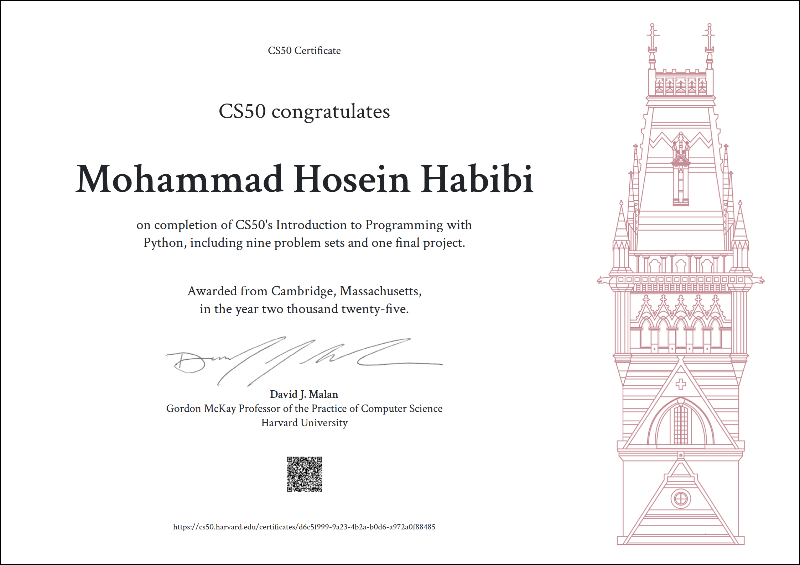

# Harvard CS50p

### These are my solutions for CS50's Introduction to Programming with Python 2025.
### Final Project: Face Recognition Security System
 

📽️[Live Demo Final Project](https://youtu.be/svjGIUoibZQ)

 

## :warning: Disclaimer:

### ❗ **The following codes are for educational purpose only and not intended to be used / submitted as your own solutions.**

### ❗ **Cheating violates the Academic Honesty of the course, not to mention it's totally pointless if you actually want to learn programming.**
